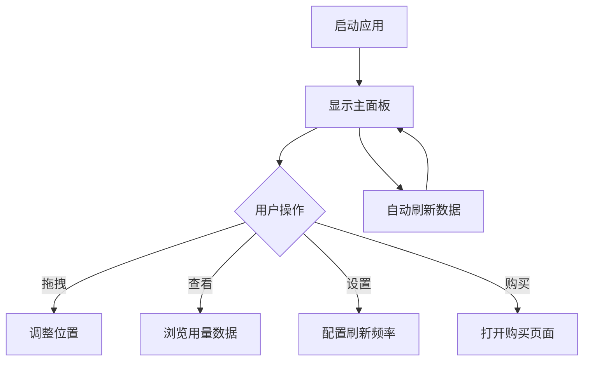

## 1. 产品概述
Trae IDE用量监控桌面小工具是一个Windows平台应用程序，用于实时监控和展示Trae IDE的使用情况。该工具以桌面悬浮窗的形式存在，用户可以随时查看当前的用量信息，包括专业版套餐、快速请求等各项数据。

目标用户：使用Trae IDE的专业版用户，需要实时了解用量情况以优化工作效率。

## 2. 核心功能

### 2.1 用户角色
无需用户注册，安装后即可使用，自动读取本地Trae IDE配置数据。

### 2.2 功能模块
本产品包含以下核心功能：
1. **用量监控面板**：显示专业版套餐、额外礼包等各项用量数据
2. **悬浮窗管理**：支持鼠标拖拽定位，始终置顶显示
3. **自动刷新**：定时更新用量数据
4. **设置管理**：配置刷新频率和显示选项

### 2.3 页面详情
| 页面名称 | 模块名称 | 功能描述 |
|---------|---------|---------|
| 主面板 | 标题区域 | 显示"用法"标题和套餐信息说明 |
| 主面板 | 快速请求区域 | 展示绿色闪电图标和"快速请求"标签 |
| 主面板 | 用量卡片列表 | 显示专业计划、额外礼包等5个用量项目的详细信息 |
| 主面板 | 进度条组件 | 每个用量项目对应的绿色进度条，直观显示使用比例 |
| 主面板 | 数值显示 | 显示当前用量/总量和剩余量，包含信息提示图标 |
| 主面板 | 购买按钮 | 白色背景的"购买额外套餐"按钮 |
| 设置面板 | 刷新频率设置 | 配置数据自动刷新时间间隔 |
| 设置面板 | 显示选项 | 设置透明度、置顶等窗口属性 |

## 3. 核心流程
用户操作流程：
1. 启动应用程序，小工具自动显示在桌面右上角
2. 鼠标拖拽调整位置，小工具会记住最后位置
3. 查看各项用量数据，包括专业版和额外礼包的使用情况
4. 点击设置按钮配置刷新频率（默认5分钟）
5. 数据自动更新，实时显示最新用量信息

## 4. 用户界面设计

### 4.1 设计风格
- **主色调**：深灰色/黑色 (#0E0E0E) 背景
- **文字颜色**：白色 (#FFFFFF) 主标题，浅灰色 (#A0A0A0) 辅助文字
- **强调色**：亮绿色 (#22C55E) 用于进度条和闪电图标
- **卡片样式**：深灰色圆角面板，内部分隔线
- **按钮样式**：白色背景配深色文字，圆角矩形设计
- **图标风格**：简约线性图标，绿色主题

### 4.2 页面设计概览
| 页面名称 | 模块名称 | UI元素 |
|---------|---------|---------|
| 主面板 | 整体布局 | 固定宽度320px，高度自适应，深色半透明背景 |
| 主面板 | 标题区域 | 大字体白色"用法"标题，下方灰色小字说明 |
| 主面板 | 用量卡片 | 深色圆角卡片，内部5个用量项目垂直排列 |
| 主面板 | 进度条 | 全宽绿色进度条，高度4px，圆角末端 |
| 主面板 | 数值显示 | 白色当前值，灰色总量，右侧剩余量显示 |
| 主面板 | 购买按钮 | 白色背景，黑色文字，圆角8px，右下角定位 |

### 4.3 响应式设计
桌面优先设计，固定尺寸小工具，不支持移动端适配。支持透明度调节，可与其他应用程序叠加显示。

### 4.4 交互设计
- **拖拽交互**：鼠标按住任意位置即可拖拽，释放后固定位置
- **悬停效果**：进度条悬停时显示具体百分比
- **信息提示**：点击信息图标显示详细说明
- **自动隐藏**：可设置鼠标离开时自动隐藏，鼠标移入时显示