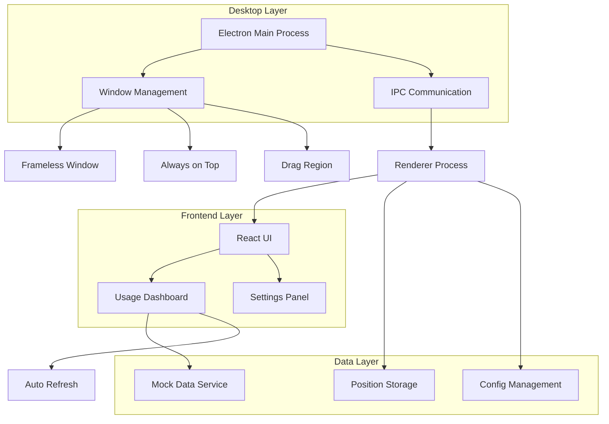
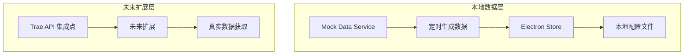

## 1. 架构设计



## 2. 技术描述

- **前端框架**: React@18 + TypeScript + Vite
- **桌面框架**: Electron@27
- **UI样式**: Tailwind CSS@3 + 自定义深色主题
- **初始化工具**: vite-init
- **状态管理**: React Context + useReducer
- **后端服务**: 无（本地数据处理）

## 3. 路由定义

| 路由 | 用途 |
|------|------|
| / | 主面板，显示用量监控界面 |
| /settings | 设置面板，配置刷新频率和显示选项 |

## 4. 数据结构定义

### 4.1 用量数据类型
```typescript
interface UsageItem {
  id: string;
  title: string;
  type: 'plan' | 'package';
  current: number;
  total: number;
  unit: string;
  resetTime?: string;
  expiryTime?: string;
  tag?: string;
}

interface UsageData {
  planType: string;
  resetDate: string;
  daysRemaining: number;
  items: UsageItem[];
}
```

### 4.2 配置类型
```typescript
interface AppConfig {
  refreshInterval: number; // 分钟
  opacity: number; // 0-1
  alwaysOnTop: boolean;
  autoHide: boolean;
  windowPosition: { x: number; y: number };
}
```

### 4.3 Electron IPC 消息
```typescript
// Main -> Renderer
interface IPCMessages {
  'usage-data-update': UsageData;
  'config-update': AppConfig;
  'window-position': { x: number; y: number };
}

// Renderer -> Main
interface IPCChannels {
  'get-usage-data': void;
  'update-config': Partial<AppConfig>;
  'set-window-position': { x: number; y: number };
  'open-external': string;
}
```

## 5. 服务器架构

无后端服务器，采用本地数据处理架构：



## 6. 数据模型

### 6.1 配置存储模型
```typescript
interface AppStorage {
  windowBounds: Rectangle;
  config: AppConfig;
  cache: {
    usageData: UsageData;
    lastUpdate: number;
  };
}
```

### 6.2 模拟数据结构
```json
{
  "planType": "专业版套餐",
  "resetDate": "2025-12-26 11:31",
  "daysRemaining": 15,
  "items": [
    {
      "id": "pro-plan",
      "title": "专业计划",
      "type": "plan",
      "current": 600.25,
      "total": 600.00,
      "unit": "GB",
      "resetTime": "2025/12/26 11:31"
    },
    {
      "id": "bonus-1",
      "title": "额外礼包（官方奖励）",
      "type": "package",
      "current": 301.14,
      "total": 300.00,
      "unit": "GB",
      "expiryTime": "2026年1月3日10:28"
    }
  ]
}
```

### 6.3 组件结构
```typescript
// 主应用组件
App
├── MainWindow
│   ├── UsageDashboard
│   │   ├── HeaderSection
│   │   ├── UsageCardList
│   │   │   └── UsageCard
│   │   └── FooterSection
│   └── SettingsPanel
└── SystemTray
```

## 7. 关键技术实现

### 7.1 Electron 主进程配置
```typescript
// 无边框窗口配置
const windowOptions: BrowserWindowConstructorOptions = {
  frame: false,
  transparent: true,
  alwaysOnTop: true,
  skipTaskbar: true,
  resizable: false,
  movable: true,
  webPreferences: {
    nodeIntegration: false,
    contextIsolation: true,
    preload: path.join(__dirname, 'preload.js')
  }
};
```

### 7.2 拖拽实现
- 使用 `-webkit-app-region: drag` CSS属性定义拖拽区域
- 通过IPC消息同步窗口位置到本地存储
- 支持边界检测，防止窗口移出屏幕

### 7.3 自动刷新机制
- 使用 `setInterval` 实现定时刷新
- 支持用户自定义刷新间隔（1-60分钟）
- 数据更新时触发UI重新渲染

### 7.4 主题样式系统
```css
:root {
  --bg-primary: #0E0E0E;
  --bg-secondary: #1A1A1A;
  --text-primary: #FFFFFF;
  --text-secondary: #A0A0A0;
  --accent-green: #22C55E;
  --border-radius: 8px;
}
```