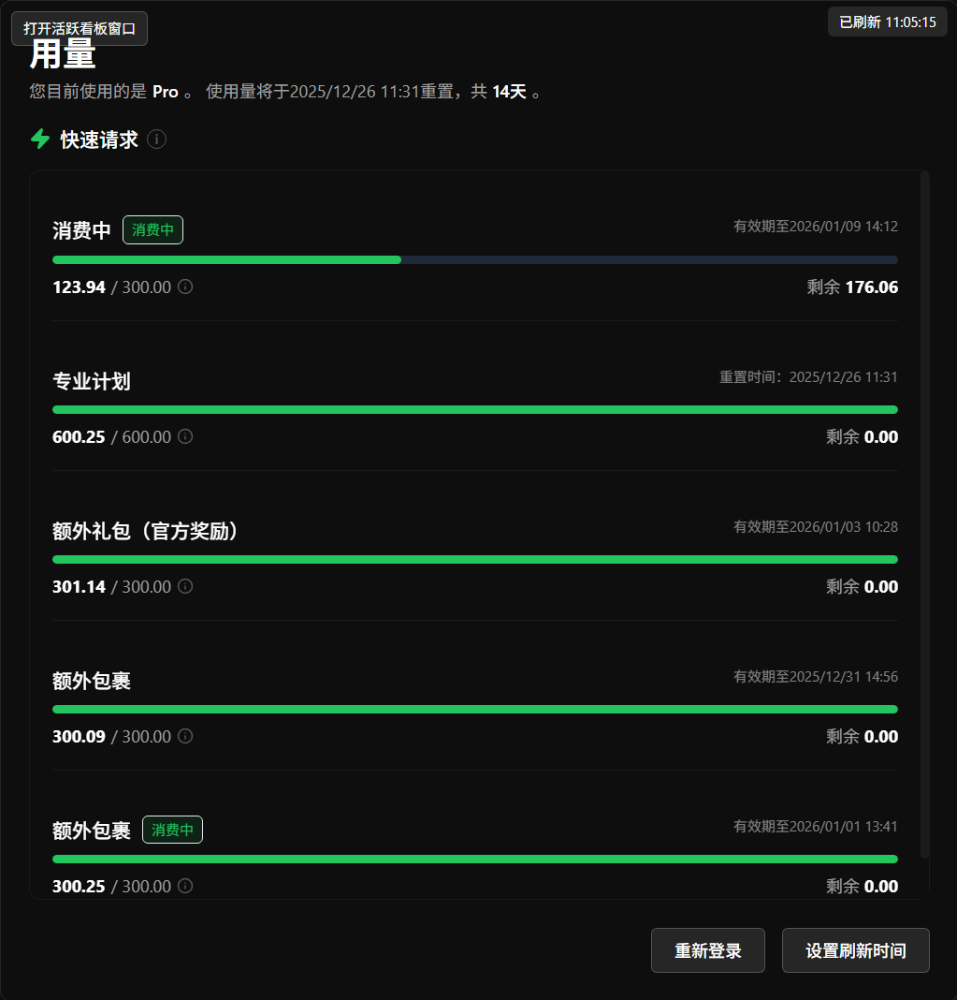

<div align="center">

# Trae Monitor

开源的轻量桌面看板，实时展示 Trae 的套餐使用情况与活跃日格子视图。
基于 Electron + React + Vite + TypeScript 构建，开箱即用，优雅好看。

[](https://vitejs.dev/)
[](https://www.electronjs.org/)
[](https://www.typescriptlang.org/)
[](https://playwright.dev/)
[](#license)

</div>

## 运行截图

<p align="center">
  
</p>

> 如果未显示，请在 `assets/` 目录中添加 `screenshot.png`（建议 1280×800 或类似比例）。

## 特性

- 套餐与扩展包用量展示，含剩余天数、重置日期等关键信息
- 独立「活跃看板」窗口，支持拖动、置顶、尺寸调整
- 一键刷新，嵌入网页仅保留 `section-SqHrr3` 区块，专注展示活跃日格子
- 自动检测无数据并切换嵌入视图，避免空白页面
- 简洁现代的 UI，Tailwind 驱动主题配色，轻量不打扰

## 快速开始

```bash
# 安装依赖
npm install

# 开发环境（React + Electron 双进程）
npm run dev

# 构建（打包前端、主进程，并生成安装包）
npm run build
```

开发模式下：

- React 前端运行在 `http://localhost:5180`
- Electron 主进程等待前端就绪后启动
- 打开主界面后，左上角按钮可打开「活跃看板」窗口

## 使用说明

- 主界面展示用量信息；刷新状态与登录状态提示在右上角显示（`src/App.tsx`）
- 打开「活跃看板」窗口后，右上角有「刷新」按钮：
  - 点击后刷新活跃数据，并嵌入网页内容，仅保留 `section-SqHrr3`
  - 无数据时自动切换到嵌入视图

核心逻辑位置：

- 仅保留 `section-SqHrr3` 的嵌入脚本：`electron/main.ts:1049`
- 刷新后触发嵌入视图：`src/components/ActiveDaysWindow.tsx:16`
- 渲染简化版活跃窗口（仅保留刷新按钮）：`src/components/ActiveDaysWindow.tsx:25`
- 预加载桥接暴露 API：`electron/preload.ts:15`

## 脚本与命令

- `npm run dev`：并发启动 React 与 Electron（开发模式）
- `npm run build`：编译前端与主进程，使用 `electron-builder` 生成安装包
- `npm run lint`：运行 ESLint
- `npm run check`：TypeScript 项目类型检查

对应定义见 `package.json`。

## 技术栈

- 前端：React 18、Vite、Tailwind CSS
- 主进程：Electron、TypeScript
- 页面解析：Cheerio、辅助（Playwright 持久化上下文）

## 目录结构（简要）

```
src/                 # 前端代码（React）
  components/        # UI 组件（含 ActiveDaysWindow）
  hooks/             # 数据获取 hooks
  types.ts           # 类型定义
electron/            # 主进程代码
  main.ts            # 窗口与 IPC、嵌入视图逻辑
  preload.ts         # 渲染进程桥接 API
dist/                # 前端构建产物
dist-electron/       # 主进程构建产物
```

## 隐私与安全

- 不会上传你的账户信息或密钥
- 仅在本地持久化必要的运行数据，避免泄露
- 不主动记录、输出任何敏感日志

## 贡献

欢迎 PR 与 Issue！

建议在提交前运行：

```bash
npm run lint
npm run check
```

## License

MIT © Trae Monitor Contributors

如果你的项目需要其他协议，请按需修改本节内容。

---

Made with ❤️ using Electron + React + Vite.
